<!-- HEADER WAVE -->
<picture> <source media="(prefers-color-scheme: dark)" srcset="haseeb-dark.svg"> <source media="(prefers-color-scheme: light)" srcset="haseeb-light.svg">  </picture>

<!-- ═══════════════════════════════════ -->
<!--           HERO SECTION             -->
<!-- ═══════════════════════════════════ -->

 

> *Building things that matter, one commit at a time.*

 

 

<!-- ═══════════════════════════════════ -->
<!--            ABOUT ME                -->
<!-- ═══════════════════════════════════ -->

## 🧑‍💻 About Me

 

| | |
|:---|:---|
| 🎓 **University** | FAST NUCES, Islamabad |
| 📍 **Location** | Islamabad, Pakistan |
| 🔭 **Currently Building** | Android Apps with Flutter · IoT Projects with Arduino · Apps in Java |
| 🌱 **Learning** | App Development & Embedded Systems |
| 💡 **Interests** | IoT · App Development · Embedded Systems · Databases |
| 🎯 **Goal** | IoT Engineer / Software Engineering Internship |
| 💬 **Ask me about** | Java · Python · Embedded Systems · C++ · DSA · OOP · SQL |

 

<!-- ═══════════════════════════════════ -->
<!--           TECH STACK               -->
<!-- ═══════════════════════════════════ -->

## 🛠️ Tech Stack

 

**Languages**

  

**Mobile & Embedded**

  

**Databases**

  

**Tools & Editors**

 

<!-- ═══════════════════════════════════ -->
<!--          GITHUB STATS              -->
<!-- ═══════════════════════════════════ -->

## 📊 GitHub Stats

 

  

  

  

  

 

<!-- ═══════════════════════════════════ -->
<!--            PROJECTS                -->
<!-- ═══════════════════════════════════ -->

## 🚀 Featured Projects

 

<table width="100%">
<tr>
<td width="50%" valign="top">

<h3>🎮 Metal Slug Game</h3>

> A terminal-based recreation of the classic Metal Slug arcade game, built in C++ using Object Oriented Programming; classes, inheritance, and polymorphism.

 

 

</td>
<td width="50%" valign="top">

<h3>🎮 TumblePop Game</h3>

> A C++ console game inspired by TumblePop, built using procedural programming; focused on game loops, collision logic, and clean structured code flow.

 

 

</td>
</tr>
</table>

 

<!-- ═══════════════════════════════════ -->
<!--          CURRENT FOCUS             -->
<!-- ═══════════════════════════════════ -->

## 🎯 Current Focus

 

| Category | Details |
|:---:|:---|
| 🏗️ **Building** | Android Apps with Flutter · IoT Projects with Arduino · Apps in Java |
| 📚 **Learning** | Java · DSA in C++ · FPGA using Verilog · SQL & Oracle DB |
| 🔍 **Exploring** | Embedded Systems & App Development |
| 🎯 **Goal** | IoT Engineer / Software Engineering Internship |
| 💬 **Ask me** | Embedded Systems &nbsp;·&nbsp; C++ &nbsp;·&nbsp; DSA &nbsp;·&nbsp; Java &nbsp;·&nbsp; Python &nbsp;·&nbsp; OOP &nbsp;·&nbsp; SQL |

 

<!-- ═══════════════════════════════════ -->
<!--         CONNECT WITH ME            -->
<!-- ═══════════════════════════════════ -->

## 🤝 Let's Connect

 

 

*Open to internship opportunities · Collaborations welcome · Always learning*

 

<!-- FOOTER WAVE -->

